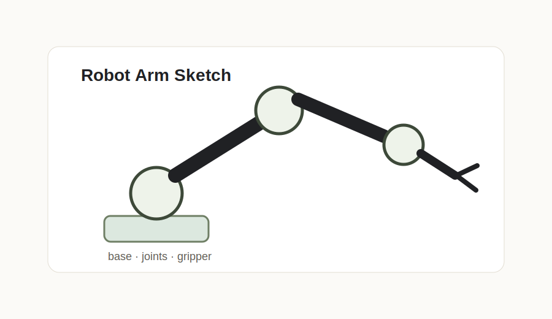

# 로봇 팔 제작 활동 1주차

## 오늘 한 일

- 로봇 팔이 수행할 기본 동작을 정했습니다.
- 필요한 부품과 도구를 목록으로 만들었습니다.
- 관절 구조와 제어 방식에 대해 조사했습니다.

## 기록할 사진

사진을 넣고 싶다면 이 글 폴더에 이미지 파일을 같이 올린 뒤 아래처럼 적습니다.



## 어려웠던 점

팔의 자유도와 실제 제작 난이도 사이에서 적절한 균형을 잡는 것이 중요했습니다.

## 다음에 할 일

- 관절 구조 구체화하기
- 서보 모터 제어 방식 정리하기
- 첫 번째 프로토타입 제작하기

```toc
```
