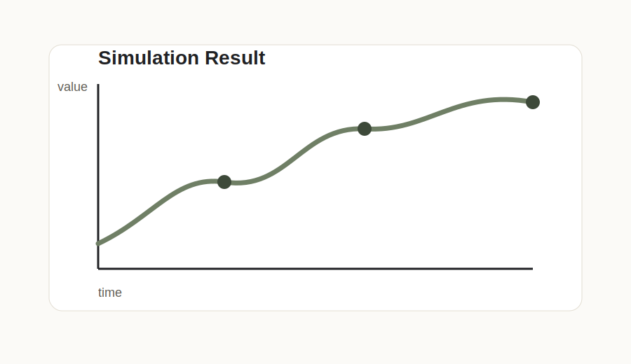

# 시뮬레이션 구현 활동 1주차

## 오늘 한 일

- 시뮬레이션으로 다룰 문제를 정했습니다.
- 입력값, 출력값, 관찰해야 할 변수를 나누어 보았습니다.
- Python으로 구현할 때 필요한 라이브러리를 정리했습니다.

## 기록할 사진

사진을 넣고 싶다면 이 글 폴더에 이미지 파일을 같이 올린 뒤 아래처럼 적습니다.



## 어려웠던 점

문제를 수식이나 코드로 바꾸기 전에 무엇을 관찰할지 정하는 과정이 생각보다 중요했습니다.

## 다음에 할 일

- 간단한 초기 모델 만들기
- 결과를 그래프로 시각화하기
- 실제 결과와 예상 결과 비교하기

```toc
```
